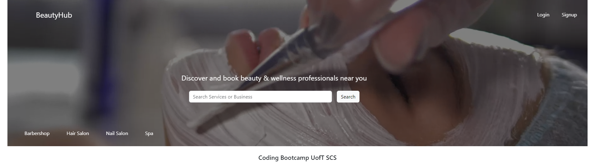
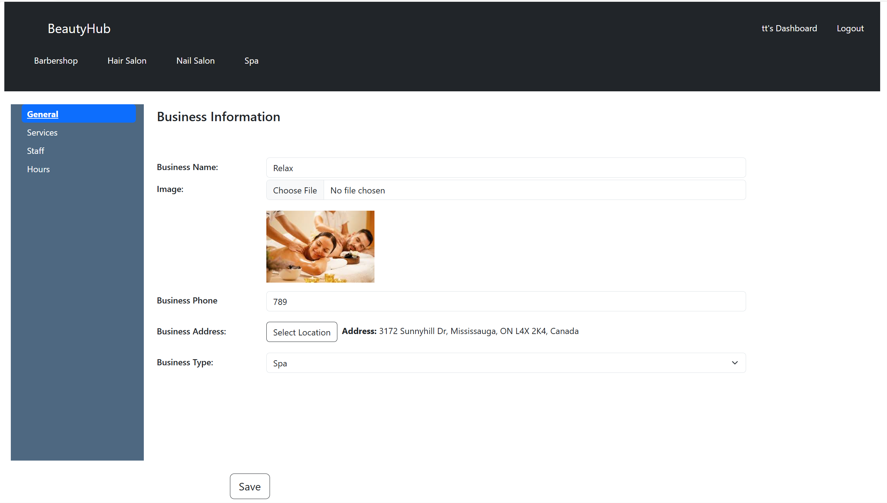

# BeautyHub

## Description

A web application for booking cosmetic services, where business owners can manage their offerings and schedules, and users can find, book, and review services seamlessly.

Our motivation for this project was to create a space for anybody looking for beauty/cosmetic services. We built this project with the hope of making everyones lives easier when seeking out business to get their nails, hair, makeup etc done. Our hope for the project was to solve peoples issue of having to put in the extra steps to see business, stylists, reviews and prices without having to go look at every stores individual page and compare, It's all laid out for you in one convenient space.

## Installation

To run the page locally open integrated terminal

```sh
npm install
npm run develop
```

You can see the deployed app [here](https://beautyhub.onrender.com/)

## Usage

For searching businesses visit the website.



If you are a business owner you can signup and use the dashboard to add your business information.



## Credits

- [Ehsan Hosesseini](https://github.com/ehsanh2001)
- [Jaqueline Farias de Souza Esteves](https://github.com/jaquelineesteves)
- [Ryan Cuthbert](https://github.com/Ryan3389)
- [Justin Morris](https://github.com/Jmorris38)
- [Alexis Brown-Renshaw](https://github.com/KatLeviathan)
